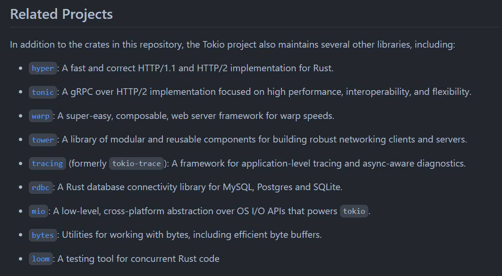

# w6 설명자료

- w5랑 거의 같음


- 똑같이 tokio로 주고 받는데, Once인 경우와 Stream인 경우를 나누어서 처리함.
- 이거를 Header를 따로두어서 직업 바이트를 읽으면서 책에서는 처리함.  이번에는 그냥 match로 처리해버림


### 기본 자료구조

```rust
#[derive(Debug, Serialize, Deserialize)]
pub struct Request {
  tag: usize,
  value: u32,
}

#[derive(Debug, Serialize, Deserialize)]
pub struct StreamRequest{
    tag: usize,
    value: Vec<String>,
}

#[derive(Debug, Serialize, Deserialize)]
pub enum CollatzInput {
    Once(Request),
    Stream(StreamRequest),
}


impl Request {
  pub fn new(val: u32) -> Self {
    Request { tag: 0, value: val }
  }
    pub fn set_tag(&mut self, tag: usize) {
    self.tag = tag;
  }
}

// value만 바꿈
impl StreamRequest{
    pub fn new(sv: Vec<String>) -> Self {
        StreamRequest {tag: 0, value: sv}
    }
    pub fn set_tag(&mut self, tag: usize) {
    self.tag = tag;
  }
}

#[derive(Debug, Serialize, Deserialize)]
pub struct Response {
  tag: usize,
  value: u32,
  collatz_str: String,
}

impl From<Request> for Response {
  fn from(r: Request) -> Response {
    Response {
      tag: r.tag,
      value: r.value,
      collatz_str: String::new(),
    }
  }
}

impl From<StreamRequest> for Response {
    fn from(r: StreamRequest) -> Response {
      Response {
        tag: r.tag,
        value: 0,
        collatz_str: String::from("Foo"),
      }
    }
  }

impl Response {
  pub fn get_tag(&self) -> usize {
    self.tag
  }

  pub fn get_collatz_str(&self) -> &str {
    &self.collatz_str
  }

  fn new(r: Request, v: Vec<u32>) -> Response {
    Response {
      tag: r.tag,
      value: r.value,
      collatz_str: format!("{:?}", v),
    }
  }
}
```

- stream에 대한 대답은 그냥 Foo로 하기때문에 from도 그렇게 만듦.

```rust
impl From<Request> for Response {
  fn from(r: Request) -> Response {
    Response {
      tag: r.tag,
      value: r.value,
      collatz_str: String::new(),
    }
  }
}

impl From<StreamRequest> for Response {
    fn from(r: StreamRequest) -> Response {
      Response {
        tag: r.tag,
        value: 0,
        collatz_str: String::from("Foo"),
      }
    }
  }
```


- call function에서 input을 CollatzInput으로 바꾸고 match로 타입마다 다르게 처리


```rust
pub struct CollatzService;

impl Service<CollatzInput> for CollatzService {
  type Response = Response;
  type Error = ();
  type Future = futures_util::future::Ready<Result<Self::Response, Self::Error>>;

  fn poll_ready(&mut self, _: &mut Context<'_>) -> Poll<Result<(), Self::Error>> {
    Poll::Ready(Ok(()))
  }

  fn call(&mut self, req: CollatzInput) -> Self::Future {
      // req match로 Once랑 Stream 비교
      match req{
        CollatzInput::Once(request) => {
            println!("got {}", request.value);
            let seq = get_sequence(request.value);
            futures_util::future::ok(Response::new(request, seq))
        },
        CollatzInput::Stream(streamrequest) => {
            streamrequest.value.iter().for_each(|line| {
                println!("{}", line);                
            });
            
            futures_util::future::ok(Response::from(streamrequest))
        },
      }        
  }
}
```


## server.rs

- 이전과 같음.

```rust
#[tokio::main]
async fn main() {
  let rx = TcpListener::bind("0.0.0.0:7777").await.unwrap();
  
  // accept
  let (rx, _) = rx.accept().await.unwrap();
  let rx = AsyncBincodeStream::from(rx).for_async();
  let server = Server::new(rx, CollatzService);

  tokio::spawn(async move { server.await.unwrap() });
}
```


## Client.rs

- 전달하는 방식은 이전과 같이 tx.call에 struct를 넣어준다.

```rust
#[tokio::main]
async fn main() {
  // connect
  let tx = TcpStream::connect("127.0.0.1:7777").await.unwrap();
  let tx: AsyncBincodeStream<_, Response, _, _>  = AsyncBincodeStream::from(tx).for_async();
  let mut tx: Client<_, PanicError, _> = Client::new(MultiplexTransport::new(tx, SlabStore(Slab::new())));
  unwrap(ready(&mut tx).await);
  let fut1 = tx.call(CollatzInput::Once(Request::new(10)));
  println!("{:?}", unwrap(fut1.await));
  unwrap(ready(&mut tx).await);
  let sv:Vec<String> = vec!["hello".to_string(), "world".to_string(), "!".to_string()];
  let fut2 = tx.call(CollatzInput::Stream(StreamRequest::new(sv)));
  let f = fut2.await;
  println!("{:?}", unwrap(f));
}
```


## ref

- https://github.com/tower-rs/tokio-tower/blob/master/tests/multiplex/mod.rs
- https://github.com/lexstudium/networkp_rust/blob/main/w5/hyunmin.md
- https://github.com/tower-rs/tokio-tower/blob/master/tests/lib.rs
- https://github.com/tower-rs/tokio-tower/blob/master/tests/pipeline/client.rs

# The Larger tokio ecosystem




## tokio-curl

### curl

- libcurl 기반으로 만들어진 crate
- linux, window에서 둘 다 되지만 window는 scale 한계가 있다고 한다.

```toml
[package]
name = "curl_test"
version = "0.1.0"
edition = "2021"

# See more keys and their definitions at https://doc.rust-lang.org/cargo/reference/manifest.html

[dependencies]
curl = "0.4.42"
```

### Easy api

- Easy는 single blocking request in a thread.
- url을 지정하고
- 출력할 closure를 정한다. closure의 return은 데이터 길이
- 그 후 perform을 부른다.

```rust
use std::io::{stdout, Write};

use curl::easy::Easy;


fn main()
{
    // Write the contents of rust-lang.org to stdout
    let mut easy = Easy::new();
    easy.url("https://www.rust-lang.org/").unwrap();
    easy.write_function(|data| {
        stdout().write_all(data).unwrap();
        Ok(data.len())
    }).unwrap();
    easy.perform().unwrap();
}

```

### 추가적인  문법

### req 방식 설정

- easy.get(true) / post(true) / put(true) / delete는 없음


### header 출력

- header를 완전히 받으면 header_function이 실행된다.

```rust
let mut handle = Easy::new();
handle.url("https://www.rust-lang.org/").unwrap();
handle.header_function(|header| {
    print!("header: {}", str::from_utf8(header).unwrap());
    true
}).unwrap();
handle.perform().unwrap();
```


### write_function

- 저장될 데이터가 다 오면 실행된다.
- callback은 읽은 byte수를 리던하고, 문제가 생기면 WriteError를 리턴한다.

```rust
pub fn write_function<F>(&mut self, f: F) -> Result<(), Error>
where
    F: FnMut(&[u8]) -> Result<usize, WriteError> + Send + 'static, 
```


```rust
handle.write_function(|data| {
    Ok(stdout().write(data).unwrap())
}).unwrap();
```


### response_code

```rust
println!("{}".req.response_code());
// 200, 403 ,,,
```


## tokio-curl

- A Future interface on top of libcurl

### 공식 예시

- 위 Easy를 tokio-curl의 session으로 다시 묶어줌.

- ```rust
  let mut lp = Core::new().unwrap();
      
  let session = Session::new(lp.handle()); // HTTP session을 연결
  
   // curl part
  let mut req = Easy::new();
  // do sth
  
  let request = session.perform(req);
  
  let mut req = lp.run(request).unwrap();
  ```

- 

```rust
use std::io::{self, Write};

use curl::easy::Easy;
use futures::Future;
use tokio_core::reactor::Core;
use tokio_curl::Session;

fn main() {
    // Create an event loop that we'll run on, as well as an HTTP `Session`
    // which we'll be routing all requests through.
    let mut lp = Core::new().unwrap();
    
    
    let session = Session::new(lp.handle()); // HTTP session을 연결

    // Prepare the HTTP request to be sent.
    let mut req = Easy::new();
    req.get(true).unwrap(); // get을 쓴다. req.post(true).unwrap();
    req.url("https://www.rust-lang.org").unwrap();
    req.write_function(|data| {
        io::stdout().write_all(data).unwrap();
        Ok(data.len())
    }).unwrap();

    // Once we've got our session, issue an HTTP request to download the
    // rust-lang home page
    let request = session.perform(req);

    // Execute the request, and print the response code as well as the error
    // that happened (if any).
    let mut req = lp.run(request).unwrap();
    println!("{:?}", req.response_code());
}
```


### 책 예시

- file에 쓴다는 것만 다름

```rust
use curl::easy::Easy;
use tokio_core::reactor::Core;
use tokio_curl::Session;
use std::io::Write;
use std::fs::File;


fn main() {
    let mut core = Core::new().unwrap();
    let session = Session::new(core.handle());
    let mut handle = Easy::new();
    let mut file = File::create("foo.html").unwrap();
    handle.get(true).unwrap();
    handle.url("https://www.rust-lang.org/").unwrap();
    handle.header_function(|header| {
        print!("{}", std::str::from_utf8(header).unwrap());
        true
    }).unwrap();

    handle.write_function(move |data| {
        file.write_all(data).unwrap();
        Ok(data.len())
    }).unwrap();

    let request = session.perform(handle);
    let mut response = core.run(request).unwrap();
    println!("{:?}", response.response_code());
}
```


## ref

- https://docs.rs/curl/latest/curl/easy/struct.Easy.html
- https://docs.rs/tokio-curl/latest/tokio_curl/

